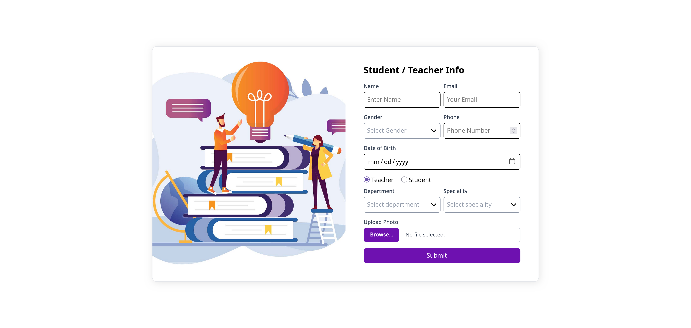

# 📘 Lab Report Form

🔗 **Live Demo:** [View Project](https://mahmuddevs.github.io/Internet-Programming-Lab-Report-2/)

---

## 📖 Description

This project is a **responsive Lab Report Form** designed with **Tailwind CSS**.  
It allows users to input **Student / Teacher information** with role-based conditional fields.  
The layout is split into two columns: an image on the left and a clean form on the right.

✨ Key Features:

- 📱 **Responsive design** (mobile-first, works on all devices)
- 🎭 **Role-based dynamic fields**:
  - **Teacher** → Department & Speciality
  - **Student** → Department & Batch
- 📅 **Date picker** for Date of Birth
- 📂 **File upload** with custom-styled input button
- 🎨 **Tailwind-based styling** with hover & transition effects
- 🔽 Custom dropdowns with Font Awesome icons

---

## 🛠️ Technologies Used

- **HTML5** – Semantic markup
- **Tailwind CSS** – Utility-first CSS framework for styling
- **Font Awesome** – Icons for dropdowns & buttons

---

## 📸 Preview

